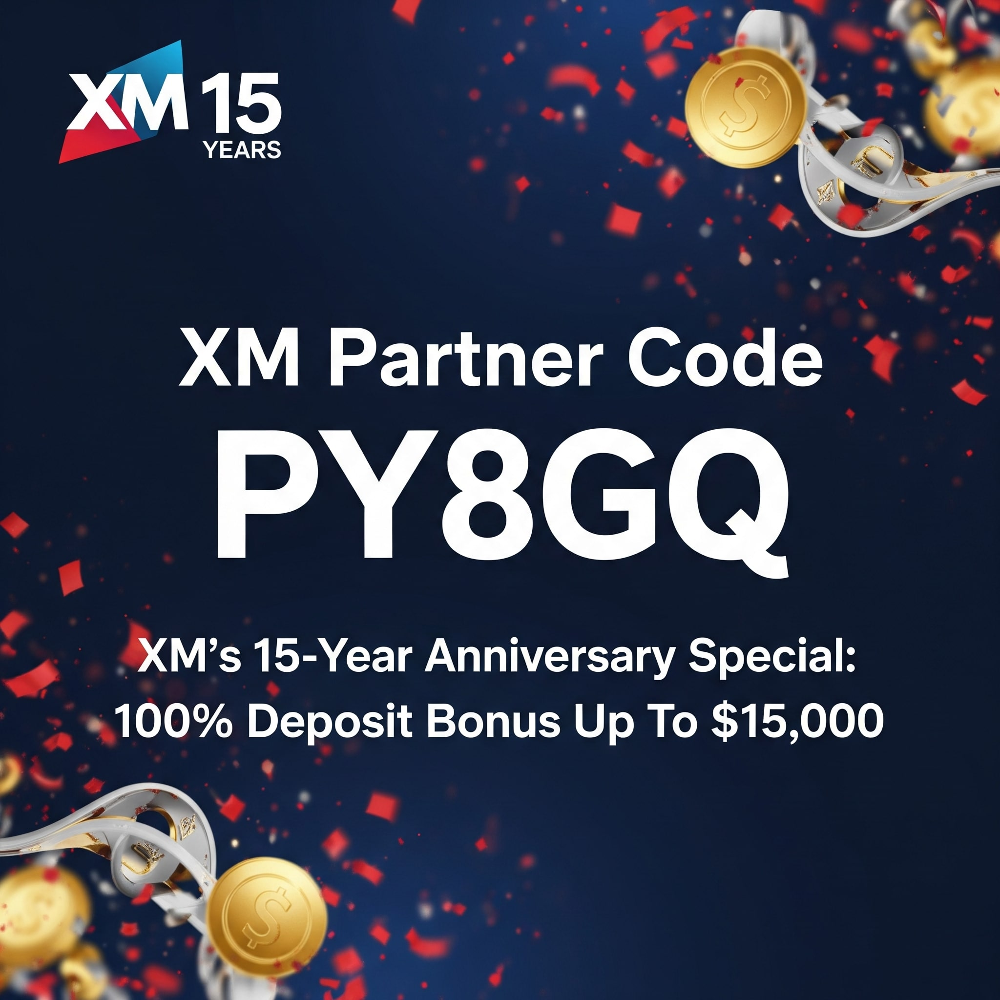

# 🔥 XM ฉลอง 15 ปี แจกโบนัส 100% สูงสุด $15,000 + สิทธิพิเศษด้วยรหัสพันธมิตร PY8GQ 🔥

เพิ่มพลังการเทรดของคุณให้เต็มพิกัดกับโปรโมชั่นที่ร้อนแรงที่สุดจาก XM! มิถุนายนนี้ XM ฉลองครบรอบ 15 ปีอย่างยิ่งใหญ่ มอบโบนัสเงินฝาก 100% สูงสุดถึง **$15,000** เมื่อคุณใช้รหัสพันธมิตร `PY8GQ` เท่านั้นยังไม่พอ! รับสิทธิประโยชน์สุดเอ็กซ์คลูซีฟอีกมากมายที่ออกแบบมาเพื่อยกระดับประสบการณ์เทรด Forex และ CFD ของคุณโดยเฉพาะ

---

## พลาดไม่ได้! รายละเอียดโปรโมชั่น:

* **รหัสพันธมิตร XM ที่ต้องใช้:** `PY8GQ`
* **ชื่อโปรโมชั่น:** ฉลองครบรอบ 15 ปี XM
* **โบนัสสูงสุด:** $15,000 (แบ่งรับรายสัปดาห์)
* **ระยะเวลาโปรโมชั่น:** 2 - 29 มิถุนายน 2025

---

## วิธีคว้าโบนัส $15,000 ฉลองครบรอบ 15 ปี:

ร่วมภารกิจสุดท้าทาย 4 สัปดาห์ในเดือนมิถุนายนนี้! คุณมีโอกาสรับโบนัสเงินฝาก 100% สูงสุด $3,750 ในแต่ละสัปดาห์ สะสมให้ครบเพื่อรับโบนัสรวมสูงสุด $15,000!

1.  **ลงทะเบียนรายสัปดาห์:** เข้าร่วมโปรโมชั่นทั้ง 4 สัปดาห์ (เริ่มลงทะเบียนต้นสัปดาห์) ผ่านเว็บไซต์ XM (ต้องมีบัญชีเทรด XM Standard ที่ยืนยันแล้ว)
2.  **เทรดให้ถึงเป้า:** เทรดสินทรัพย์ที่กำหนดในแต่ละสัปดาห์เพื่อสะสมปริมาณการเทรด (Lot)
3.  **รับโบนัสสุดคุ้ม:** รับโบนัส 100% จากยอดเงินฝากของคุณในสัปดาห์ถัดไป (มูลค่าโบนัสขึ้นอยู่กับจำนวน Lot ที่คุณเทรดได้)
4.  **ทำซ้ำ 4 สัปดาห์:** เข้าร่วมต่อเนื่องครบทั้ง 4 โปรโมชั่นเพื่อลุ้นรับโบนัสเต็ม $15,000 ยิ่งเทรดมาก ยิ่งได้มาก!

### ตารางโบนัสต่อสัปดาห์ (ขึ้นอยู่กับจำนวน Lot ที่เทรด):
| จำนวน Lot ที่เทรด (ต่อสัปดาห์) | โบนัส 100% สูงสุด (ต่อสัปดาห์) |
| :----------------------------- | :---------------------------- |
| 3                              | $100                          |
| 6                              | $300                          |
| 9                              | $1,000                        |
| 15                             | $2,000                        |
| 25                             | $3,750                        |

*หมายเหตุ: โบนัสนี้ไม่สามารถถอนเป็นเงินสดได้ แต่กำไรที่เกิดจากการเทรดด้วยโบนัสสามารถถอนได้ภายใต้ข้อกำหนดและเงื่อนไข*

---

## ทำไมต้องใช้รหัสพันธมิตร XM `PY8GQ`?

รหัส `PY8GQ` คือกุญแจสู่สิทธิประโยชน์เหนือระดับตลอดเดือนมิถุนายน 2025:

* ✅ **โบนัสใหญ่ $15,000 ฉลองครบรอบ:** เพิ่มพลังเงินทุนของคุณเป็นสองเท่า สูงสุด $15,000 ตลอดโปรโมชั่น
* ✅ **$30 โบนัสไม่ต้องฝาก (ยังคงมีอยู่!):** เริ่มต้นเทรดแบบไร้ความเสี่ยง! รับ $30 ทันทีหลังยืนยันบัญชีเพื่อทดลองแพลตฟอร์ม XM โดยไม่ต้องใช้เงินทุนของคุณ
* ✅ **โปรแกรม Lot Rebate สูงสุด 90%:** รับเงินคืนจากทุก Lot ที่คุณเทรด!
    * ตัวอย่าง: EUR/USD: $5.4/Lot (Standard), $2.7/Lot (Ultra Low Standard)
    * XAU/USD: $6.3/Lot (Standard), $5.4/Lot (Ultra Low Standard)
* ✅ **ไม่มีค่าใช้จ่ายแอบแฝง:** รหัสพันธมิตรนี้ฟรี! XM ดูแลค่าคอมมิชชั่นทั้งหมด คุณจึงได้รับกำไร 100% จากโบนัสเหล่านี้

### สิ่งที่คุณจะได้รับเมื่อใช้รหัส `PY8GQ` ในเดือนมิถุนายน 2025:

1.  **โบนัสเงินฝากสูงสุด $15,000 จากโปรโมชั่นครบรอบ:**
    * **ตัวอย่าง:** หากคุณเทรด 25 Lot ในสัปดาห์โปรโมชั่น คุณมีสิทธิ์รับโบนัส 100% สูงสุด $3,750 จากยอดฝากในสัปดาห์ถัดไป เมื่อคุณฝาก $3,750 คุณจะได้รับโบนัสเพิ่มอีก $3,750 รวมเป็น $7,500 ให้คุณเทรด! ทำซ้ำ 4 สัปดาห์เพื่อพิชิต $15,000!
2.  **โบนัส $30 ไม่ต้องฝาก:** เพียงลงทะเบียนด้วยรหัส `PY8GQ` และยืนยันตัวตนสำเร็จ!

---

## วิธีรับโบนัสเริ่มต้นง่ายๆ ใน 3 ขั้นตอน (สำหรับการเปิดบัญชีใหม่):

1.  **ลงทะเบียน:** ไปที่เว็บไซต์ XM คลิก "เปิดบัญชี"
2.  **กรอกรหัสพันธมิตร:** ในระหว่างขั้นตอนการลงทะเบียน ใส่รหัส `PY8GQ` ในช่อง "รหัสพันธมิตร" (Affiliate Code)
3.  **ยืนยันบัญชี:** ยืนยันอีเมลและดำเนินการยืนยันตัวตนให้เสร็จสิ้น โบนัส $30 จะเข้าบัญชีคุณภายใน 24 ชั่วโมง

**เพื่อเข้าร่วมโปรโมชั่นครบรอบ $15,000:** ตรวจสอบว่าคุณมีบัญชีเทรด XM Standard ที่ยืนยันแล้ว และลงทะเบียนเข้าร่วมโปรโมชั่นรายสัปดาห์ผ่านพื้นที่สมาชิก XM

**สำคัญมาก:** รหัส `PY8GQ` ต้องใช้ระหว่างการลงทะเบียนเปิดบัญชีใหม่เท่านั้น ไม่สามารถเพิ่มในบัญชีที่มีอยู่แล้วได้

---

## สรุปข้อกำหนดและเงื่อนไขสำคัญ (โปรดอ่านฉบับเต็มบนเว็บไซต์ XM):

* **โบนัสเงินฝากครบรอบ 15 ปี (สูงสุด $15,000):**
    * **ระยะเวลา:** 2 - 29 มิถุนายน 2025
    * **เงื่อนไข:** ต้องลงทะเบียนรายสัปดาห์และทำยอดเทรดตามเป้าในสินทรัพย์ที่กำหนด
    * **การให้โบนัส:** ทุกวันจันทร์ (9, 16, 23, 30 มิ.ย. 2025 เวลา 13:00 ตามเวลาเซิร์ฟเวอร์) สำหรับกิจกรรมสัปดาห์ก่อนหน้า
    * **การใช้โบนัส:** ใช้ได้กับเงินฝากภายใน 7 วันหลังจากได้รับสิทธิ์โบนัส
    * **การถอน:** โบนัสถอนไม่ได้ กำไรจากการเทรดด้วยโบนัสถอนได้ การถอนเงินทุนจะทำให้โบนัสถูกหักออกตามสัดส่วน
* **โบนัส $30 ไม่ต้องฝาก:**
    * รับหลังยืนยันบัญชี อาจมีเงื่อนไขปริมาณการเทรดขั้นต่ำก่อนถอน "ตัวโบนัส" (กำไรถอนได้ตามปกติ)
* **Lot Rebate Program:**
    * เงินคืนตามปริมาณการเทรด จ่ายเข้าบัญชีโดยตรง
* **อายุรหัส:** รหัส `PY8GQ` ใช้ได้ ณ มิถุนายน 2025 โปรโมชั่น $15,000 สิ้นสุด 29 มิ.ย. 2025 ข้อเสนออื่นอาจมีการเปลี่ยนแปลง

---

## ใครบ้างที่เหมาะกับรหัสพันธมิตร XM `PY8GQ`?

* **เทรดเดอร์มือใหม่:** ทดลองเทรดไร้ความเสี่ยงด้วยโบนัส $30 ไม่ต้องฝาก
* **เทรดเดอร์มากประสบการณ์:** เพิ่มพลังเงินทุนมหาศาลด้วยโบนัส 100% สูงสุด $15,000
* **Copy Traders:** เพิ่มโอกาสในการคัดลอกนักลงทุนชั้นนำด้วยเงินทุนที่มากขึ้น
* **เทรดเดอร์ทุกคน:** รับประโยชน์จาก Lot Rebate ต่อเนื่อง คืนกำไรให้คุณไม่ว่าผลการเทรดจะเป็นอย่างไร

---

## XM คือใคร? 15 ปีแห่งความเป็นเลิศด้านการเทรด

XM คือโบรกเกอร์ระดับโลกที่ได้รับความไว้วางใจและอยู่ภายใต้การกำกับดูแลหลายแห่ง มีประสบการณ์กว่า 15 ปี ให้บริการลูกค้าหลายล้านคนในกว่า 190 ประเทศ นำเสนอการเทรด Forex, หุ้น, สินค้าโภคภัณฑ์, ดัชนี และสกุลเงินดิจิทัล ผ่านแพลตฟอร์มที่ใช้งานง่ายและเครื่องมือที่ทรงพลัง

### เหนือกว่าด้วยบริการจาก XM:

* **ความเร็วในการดำเนินการคำสั่งซื้อขาย:** ราคาที่ดีกว่าและโอกาสที่ไม่สะดุด
* **ไม่มีการปฏิเสธคำสั่ง:** ดำเนินการซื้อขายกว่า 10.3 พันล้านรายการโดยไม่มีการปฏิเสธหรือรีโควต
* **โบนัสตลอดปี:** โปรโมชั่น $15,000 นี้คือโปรที่ใหญ่ที่สุด แต่ XM มีโบนัสอื่นๆ มอบให้เสมอ!
* **ถอนเงินทันที 24/7:** ไม่มีค่าธรรมเนียม แม้ในวันหยุดสุดสัปดาห์
* **การศึกษาฟรีจากผู้เชี่ยวชาญ:** สัมมนาออนไลน์, บทเรียน, และบทวิเคราะห์ตลาด
* **การสนับสนุนหลายภาษา 24/7:** ช่วยเหลือกว่า 30 ภาษา

### คุณสมบัติเด่นของ XM:

* ประเภทบัญชีหลากหลาย (Standard Account จำเป็นสำหรับโปรฯ นี้)
* แพลตฟอร์ม MT4/MT5
* ป้องกันยอดเงินคงเหลือติดลบ

---

## ข้อดี-ข้อเสียกับ XM และโปรโมชั่นนี้

### ข้อดี:

* รับโบนัสพิเศษฉลอง 15 ปี สูงสุด $15,000 ด้วยรหัส `PY8GQ`
* รับเพิ่ม $30 โบนัสไม่ต้องฝาก และ Lot Rebate
* โบรกเกอร์ที่น่าเชื่อถือ มีการกำกับดูแล และประสบการณ์ยาวนาน
* ดำเนินการคำสั่งรวดเร็ว นโยบายไม่ปฏิเสธคำสั่ง
* เทรดแบบไม่มีค่าคอมมิชชั่นในบัญชีส่วนใหญ่
* ป้องกันยอดเงินติดลบ
* ถอนเงินรวดเร็ว 24/7

### ข้อเสีย:

* โบนัส (รวมถึงโปรฯ ครบรอบ) มีเงื่อนไขด้านปริมาณการเทรด (กำไรถอนได้)
* ไม่สามารถให้บริการได้ในบางประเทศ
* ตัวเลือกสกุลเงินดิจิทัลอาจมีจำกัดเมื่อเทียบกับแพลตฟอร์มเฉพาะทาง
* การเทรดมีความเสี่ยงทางการเงินสูง

---

## คำถามที่พบบ่อย (FAQ)

* **รหัสพันธมิตร XM `PY8GQ` คืออะไร?**
    รหัสฟรีที่ปลดล็อกโบนัสเงินฝาก 100% สูงสุด $15,000 (2-29 มิ.ย. 2025), โบนัส $30 ไม่ต้องฝาก และ Lot Rebate
* **ใช้รหัสนี้กับบัญชีที่มีอยู่ได้ไหม?**
    ไม่ได้ รหัส `PY8GQ` ต้องใช้ตอนเปิดบัญชีใหม่เท่านั้น
* **โปรโมชั่นครบรอบ $15,000 เข้าร่วมอย่างไร?**
    มีบัญชี XM Standard ที่ยืนยันแล้ว จากนั้นลงทะเบียนเข้าร่วมโปรโมชั่นรายสัปดาห์ เทรดตามเป้าเพื่อรับโบนัส
* **ต้องเข้าร่วมครบ 4 สัปดาห์หรือไม่?**
    ไม่จำเป็น แต่ละสัปดาห์สามารถรับโบนัสสูงสุด $3,750 ได้ การเข้าร่วมครบ 4 สัปดาห์จะทำให้มีโอกาสรับเต็ม $15,000
* **รับโบนัสเงินฝากเมื่อไหร่?**
    ทุกวันจันทร์ เวลา 13:00 (เวลาเซิร์ฟเวอร์) สำหรับสัปดาห์ก่อนหน้า (9, 16, 23, 30 มิ.ย. 2025)
* **มีเวลานานแค่ไหนในการใช้สิทธิ์โบนัสที่ได้รับในแต่ละสัปดาห์?**
    7 วัน สิทธิ์โบนัสจะถูกนำไปใช้กับการฝากเงินของคุณจนกว่าจะครบจำนวนที่คุณได้รับ หรือจนกว่าจะหมดอายุ
* **ถอนโบนัสครบรอบได้หรือไม่?**
    ไม่ได้ ตัวโบนัสใช้สำหรับเทรดเท่านั้น แต่กำไรที่ทำได้จากโบนัสสามารถถอนได้

---

## 🚀 พร้อมหรือยังที่จะเริ่มต้นเทรดกับโบนัสสุดพิเศษที่ใหญ่ที่สุดจาก XM?

ใช้รหัสพันธมิตร `PY8GQ` ระหว่างการลงทะเบียน เพื่อปลดล็อกโบนัสเงินฝาก 100% สูงสุด $15,000 ฉลองครบรอบ 15 ปี XM และรับโบนัส $30 ไม่ต้องฝากทันที!

---

## ⚠️ คำเตือนความเสี่ยง:

การเทรด Forex และ CFD มีความเสี่ยงสูงและอาจไม่เหมาะสำหรับนักลงทุนทุกคน โปรโมชั่นโบนัสมีข้อกำหนดและเงื่อนไข โปรดอย่าลงทุนด้วยเงินที่คุณไม่สามารถจะสูญเสียได้ เนื้อหานี้มีวัตถุประสงค์เพื่อให้ข้อมูลเท่านั้น และไม่ควรถือเป็นคำแนะนำทางการเงิน โปรดอ่านและทำความเข้าใจข้อกำหนดและเงื่อนไขฉบับเต็มของ XM ทุกครั้งก่อนเข้าร่วมโปรโมชั่นหรือทำการซื้อขายใดๆ
